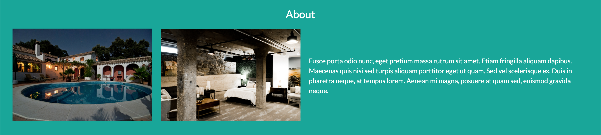

# Thinkfulbnb

Thinkfulbnb is a vacation rental website that allows people to rent out their homes to people who are seeking short-term accommodations in that locale. Thinkfulbnb hosts rent out different kinds of properties, including single rooms, apartments, and unique living spaces such as yachts, houseboats, yurts, tiny houses, and even renovated medieval castles.

This project was completed as part of the Thinkful curriculum for a Software Engineering Immersion program.   

### Mobile view

### Desktop view

# starter-thinfulbnb
